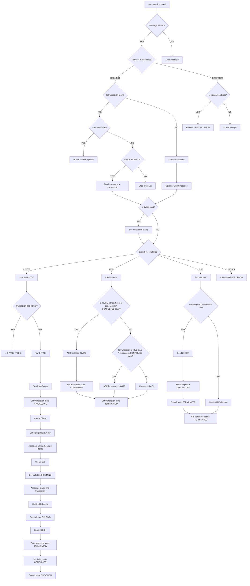

## MOCK UAS SERVER

## Message processing for basic call scenario

```mermaid
flowchart TD
    1[Message Received]-->2{Message Parsed?}
    2-->|YES| 3{Request or Response?}
    2-->|NO| 4[Drop message]
    3-->|REQUEST| 5{Is transaction Exist?}
    3-->|RESPONSE| 6{Is transaction Exist?}
    5-->|YES| 7{Is retransmitted?}
    5-->|NO| 8[Create transacton]
    6-->|YES| 9[Process response - TODO]
    6-->|NO| 10[Drop message]
    7-->|YES| 11[Return latest response]
    7-->|NO| 12{Is ACK for INVITE?}
    12-->|YES| 13[Attach message to transaction]
    12-->|NO| 14[Drop message]
    8-->15[Set transaction message]
    15-->16{Is dialog exist?}
    13-->16
    16-->|YES| 17[Set transaction dialog]
    16-->|NO| 18{Branch for METHOD}
    17-->18
    18-->|INVITE| 19[Process INVITE]
    18-->|ACK| 20[Process ACK]
    18-->|BYE| 21[Process BYE]
    18-->|OTHER| 22[Process OTHER - TODO]
    19-->23{Transaction has dialog ?}
    23-->|YES| 24[re-INVITE - TODO]
    23-->|NO| 25[new INVITE]
    25-->26[Send 100 Trying]
    26-->27[Set transaction state PROCEEDING]
    27-->28[Create Dialog]
    28-->29[Set dialog state EARLY]
    29-->30[Associate transaction and dialog]
    30-->31[Create Call]
    31-->32[Set call state INCOMING]
    32-->33[Associate dialog and transaction]
    33-->34[Send 180 Ringing]
    34-->35[Set call state RINGING]
    35-->36[Send 200 OK]
    36-->37[Set transaction state TERMINATED]
    37-->38[Set dialog state CONFIRMED]
    38-->39[Set call state ESTABLISH]
    20-->40{Is INVITE transaction ? Is transaction in COMPLETED state? }
    40-->|YES| 41[ACK for failed INVITE]
    41-->42[Set transaction state CONFIRMED]
    40-->|NO| 43{Is transaction in IDLE state ? Is dialog in CONFIRMED state?}
    43-->|YES| 44[ACK for success INVITE]
    43-->|NO| 45[Unexpected ACK]
    42-->46[Set transaction state TERMINATED]
    44-->46
    45-->46
    21-->47{Is dialog in CONFIRMED state}
    47-->|YES| 48[Send 200 OK]
    48-->49[Set dialog state TERMINATED]
    49-->50[Set call state TERMINATED]
    47-->|NO| 51[Send 403 Forbidden]
    51-->52[Set transaction state TERMINATED]
    50-->52

```

